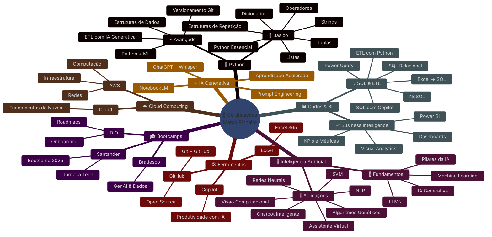

## Olá, seja bem-vindo! 👋

Sou **Marco Pinheiro** e aqui você encontrará **projetos técnicos, estudos práticos e evolução constante em tecnologia**, organizados em repositórios no GitHub.

🚀 Foco atual: **Python | IA Generativa | Dados | Cloud | Machine Learning | Automação**

📅 Última atualização

26/04/2026
🔄 Em breve novas stacks, projetos e certificações.

📈 Atividade no GitHub

🚀 Sobre mim

🎯 Estudante focado em crescimento técnico acelerado.
💡 Buscando domínio prático em tecnologia moderna.
📚 Aprendizado contínuo com foco em mercado real.
🛠 Construindo projetos para portfólio e empregabilidade.
🌎 Objetivo: atuar em grandes empresas de tecnologia.

🔗 Redes e Contato

# atualizando redes em breve 

🛠 Habilidades e Tecnologias
Linguagem Principal

# atualizaçao de seçao em breve 

Stack em evolução

🔹 Python Avançado
🔹 SQL e Bancos de Dados
🔹 Power BI
🔹 Machine Learning
🔹 IA Generativa
🔹 AWS Cloud
🔹 Git e GitHub
🔹 APIs e Automação
🔹 Streamlit / Interfaces Web

📌 Filosofia

Aprender rápido.
Construir projetos reais.
Evoluir continuamente.
Gerar valor com tecnologia.

🚧 Em construção...

Este perfil está em constante evolução. Novos projetos em breve.
